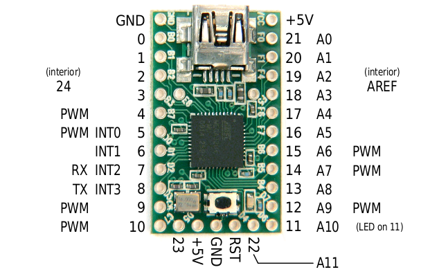
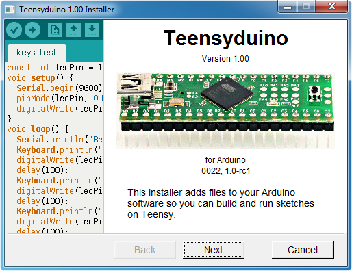
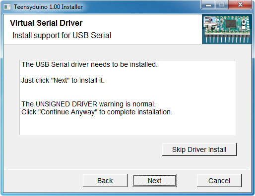
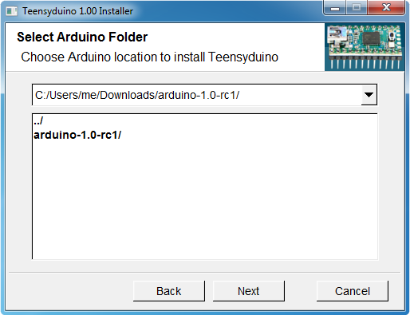
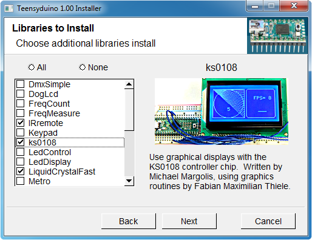
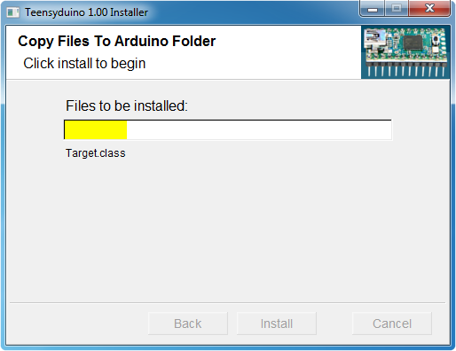
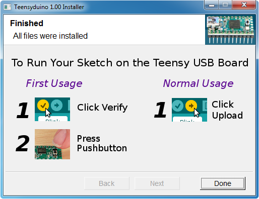
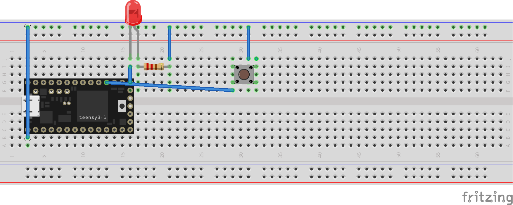

##Code Liberation Physical Computing Class

### Breadboard Patching
First off, let's talk about a few simple ideas. We are going to lay out our circut with a microcontroller called the Teensy. 

####What's a microcontroller? 

A Microcontroller is a small computer on a single integrated circuit containing a processor core, memory, and programmable input/output peripherals. Program memory in the form of NOR flash or OTP ROM is also often included on chip, as well as a typically small amount of RAM.

####What's Arduino? 
Arduino is a tool for making computers that can sense and control more of the physical world than your desktop computer. It's an open-source physical computing platform based on a simple microcontroller board, and a development environment for writing software for the board.

####What's the Teensy? 
The Teensy is a complete USB-based microcontroller development system, in a very small footprint, capable of implementing many types of projects. All programming is done via the USB port. No special programmer is needed, only a standard "Mini-B" USB cable and a PC or Macintosh with a USB port.
Here's a list of the port numbers on the Teensy. These are the port numbers we will read and write to.

####What's a breadboard? 
It's a prototyping board that lets you quickly sketch ideas. The way it works is that the power and ground rails, indicated by the +/- are all connected vertically and the rails labeled a-3 are connected horizontally. 

By placing the teensy on the breadboard, you can send data to the computer and from the computer via serial. Serial is just a communication protocol where signals arrive in a specific order. (This is simplifying things but it's good enough for today! I suggest reading Exploring Arduino for more information on this platform.) 

You can almost conceptually think of these just like any other ports such as USB. You can plug things like sensors and leds into them and then program them to do things! 

Today we are going to use the Teensy to draw circles in processing. 

Let's go get everything we will need to do this. 

1. Arudio SDK
2. The Teensy drivers for arduino 
2. Processing 
3. The arduino library for processing
http://playground.arduino.cc/Interfacing/Processing

Step 1. Download the Arudino sdk 
http://arduino.cc/en/Main/Software

Step 2. 
Download & Install Teensyduino from here. 

You are using (and are now the proud owner of) a Teensy 2.0 
https://www.pjrc.com/teensy/teensyduino.html

Step 3: Run Teensyduino Installer

The Teensyduino installer adds the necessary support files to Arduino.

On Windows, this driver allows to you access the serial device type. This step is not necessary and does not appear on Mac OS-X and Linux.

 

Select the location where you extracted the Arduino Software. The Next button will only activate when a supported version of the Arduino Software is found.

 

Teensyduino can automatically install many libraries that are tested and verified to work with Teensy.

 

The installer will copy all the necessary files into your Arduino Software.

 

When installation is finished, you will see this final screen. Just click Done to quit the installer.

 

Let's now go ahead and patch everything up. 

### Now Let's jump into the code. 

Let's download the ardunio processing library 
http://playground.arduino.cc/Interfacing/Processing

We can just follow the steps listed here to get processing setup for Arudino

Note recent working processing code: 
http://forum.arduino.cc/index.php?topic=122177.0

